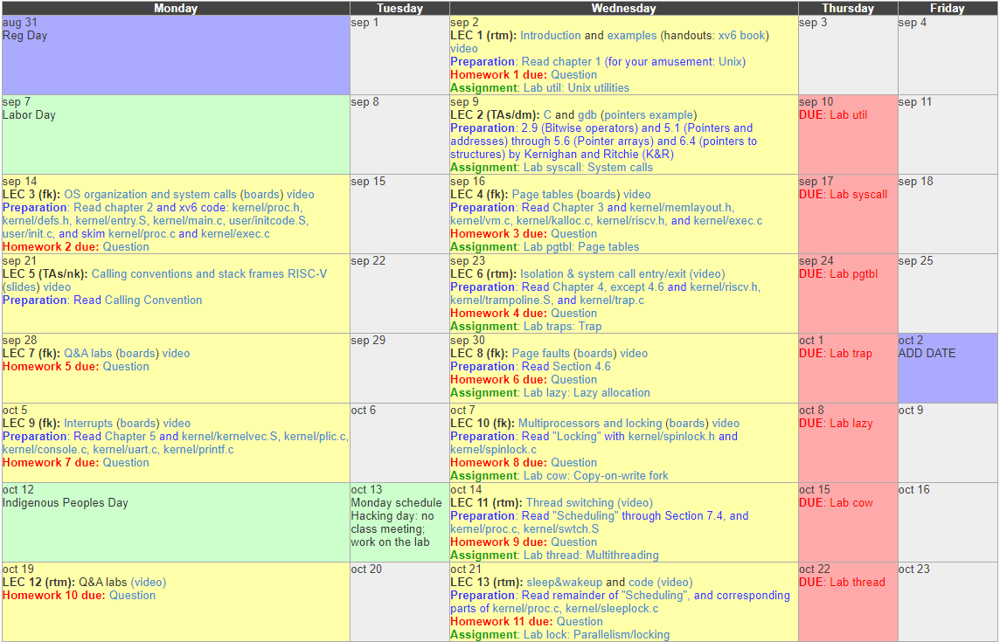
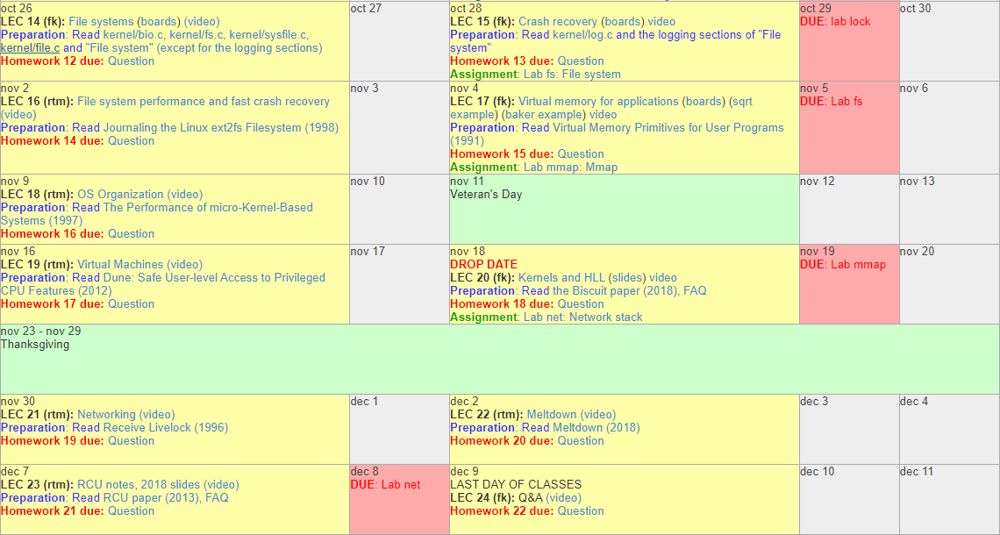

# 简介
因为学习MIT6.824，看了MIT6.S081这门课程。MIT6.S081这门课程的标题是Operating System Engineering，主要讲的就是操作系统。授课教授是Robert Morris和Frans Kaashoek，两位都是非常出名的程序员。

按照原课程，其实有个计划表如下

[计划表原地址](https://pdos.csail.mit.edu/6.828/2020/schedule.html)
在计划表中它的讲义是英文的，我看国内好像没有这个讲义的中文版，这里，我每天坚持翻译一下。
另外每次课上由于都是英文的，没有中文翻译，不过好在这位githuber提供了中文版的翻译,英文不好的同学可以用这个结合着视频看一下。